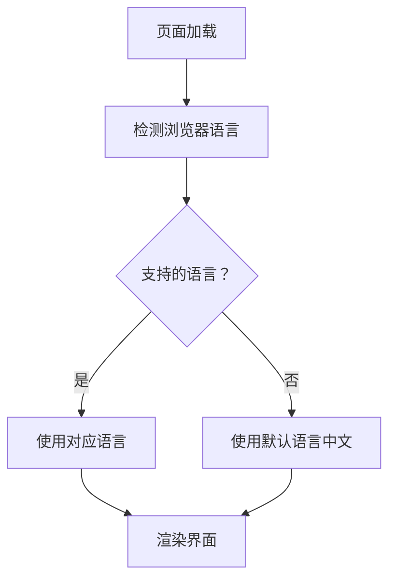
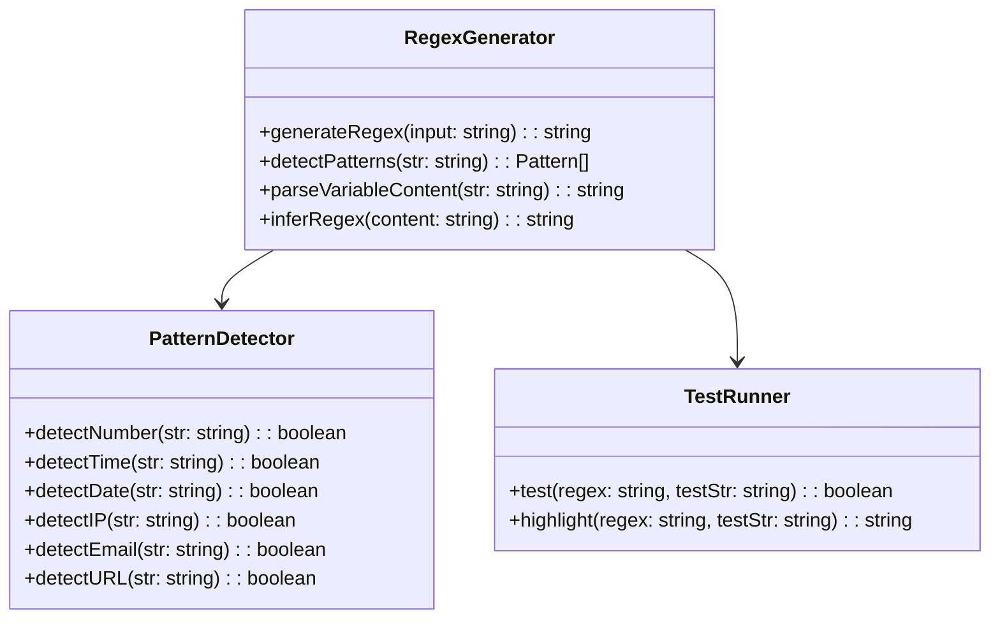

# 正则表达式生成器 - 设计方案

## 项目概述

创建一个基于 Web 的正则表达式生成工具，用户输入示例字符串，工具自动分析并生成对应的正则表达式。

## 功能需求

### 1. 核心功能

- **字符串输入**：用户提供示例字符串
- **自动模式检测**：识别字符串中的常见模式
- **可变内容标记**：使用 `{{内容}}` 语法标记可变部分
- **正则生成**：根据分析结果生成正则表达式
- **正则测试**：提供测试区域验证生成的正则
- **一键复制**：快速复制生成的正则表达式

### 2. 自动检测规则

| 模式类型 | 示例 | 生成的正则 |
|---------|------|-----------|
| 整数 | `123`, `0`, `9999` | `\d+` |
| 时间 (HH:MM:SS) | `20:00:11` | `\d{2}:\d{2}:\d{2}` |
| 时间带毫秒 | `20:00:11.846` | `\d{2}:\d{2}:\d{2}\.\d{3}` |
| 日期 | `2024-01-01` | `\d{4}-\d{2}-\d{2}` |
| 日期时间 | `2024-01-01 10:00:00` | `\d{4}-\d{2}-\d{2} \d{2}:\d{2}:\d{2}` |
| 日期时间带毫秒 | `2024-01-01 10:00:00.123` | `\d{4}-\d{2}-\d{2} \d{2}:\d{2}:\d{2}\.\d{3}` |
| IP 地址 | `192.168.1.1` | `\d{1,3}\.\d{1,3}\.\d{1,3}\.\d{1,3}` |
| 邮箱 | `test@example.com` | `\w+@\w+\.\w+` |
| URL | `https://example.com` | `https?://\S+` |
| 制表符 | `\t` | `\t` |
| 连续空格 | `   ` (2 个以上空格) | `\s+` |
| 单个空格 | ` ` | `\s` |
| 大写字母串 | `ABC`, `XAUUSD` | `[A-Z]+` |
| 小写字母串 | `abc`, `test` | `[a-z]+` |
| 混合字母 | `AI_Trader` | `[A-Za-z_]+` |
| 字母数字混合 | `M5`, `qwen3.5` | `[A-Za-z0-9.]+` |
| 中文字符 | `应用程序启动`, `你好` | `[\u4e00-\u9fa5]+` |
| 日文字符 (平假名) | `こんにちは` | `[\u3040-\u309f]+` |
| 日文字符 (片假名) | `コンニチハ` | `[\u30a0-\u30ff]+` |
| 韩文字符 | `안녕하세요` | `[\uac00-\ud7af]+` |
| CJK 统一表意文字 | `中文日文韩文` | `[\u4e00-\u9fff]+` |
| 混合多语言 | `Hello 世界こんにちは` | `[\u4e00-\u9fff\u3040-\u309f\u30a0-\u30ffA-Za-z]+` |
| 可变内容 (用户标记) | `{{M5}}` | 根据内容推断 |

### 3. 可变内容处理

用户可以使用 `{{...}}` 语法标记字符串中可能变化的部分：

**示例 1：**
```
原文：AI_Trader_EA XAUUSDm,{{M5}}: qwen3.5-plus-1
生成：AI_Trader_EA [A-Za-z_]+,[A-Z0-9]+: [A-Za-z0-9.-]+
```

**示例 2：**
```
原文：{{2024-01-01}} {{10:00:00.123}} INFO [{{main}}]
生成：\d{4}-\d{2}-\d{2} \d{2}:\d{2}:\d{2}\.\d{3} INFO \[\w+\]
```

## 系统架构

```mermaid
flowchart TD
    A[用户输入字符串] --> B[预处理]
    B --> C{检测{{可变内容}}?}
    C -->|是 | D[提取可变内容]
    C -->|否 | E[全字符串分析]
    D --> F[分析可变内容类型]
    E --> G[自动模式匹配]
    F --> H[生成对应正则]
    G --> H
    H --> I[拼接完整正则]
    I --> J[显示结果]
    J --> K[用户测试验证]
    K --> L[复制使用]
```

## 多语言支持

### 支持的语言

| 语言代码 | 语言名称 | 说明 |
|---------|---------|------|
| zh-CN | 简体中文 | 默认语言 |
| en | English | 英语 |
| ru | Русский | 俄语 |
| ja | 日本語 | 日语 |
| ko | 한국어 | 韩语 |
| fr | Français | 法语 |
| de | Deutsch | 德语 |
| es | Español | 西班牙语 |

### 语言检测逻辑



### 翻译键值

```javascript
const i18n = {
  'zh-CN': {
    title: '正则表达式生成器',
    inputLabel: '输入示例字符串：',
    placeholder: '支持使用 {{...}} 标记可变内容，例如：AI_Trader_EA XAUUSDm,{{M5}}: qwen3.5-plus-1',
    generateBtn: '生成正则',
    clearBtn: '清空',
    resultLabel: '生成的正则表达式：',
    copyBtn: '复制',
    copied: '已复制！',
    testLabel: '测试正则：',
    testInput: '输入测试字符串...',
    testBtn: '测试匹配',
    matchSuccess: '✓ 匹配成功',
    matchFail: '✗ 匹配失败',
    patternExplanation: '模式说明：',
    usageTitle: '使用说明',
    usageContent: '使用 {{...}} 包裹可能变化的内容，系统会自动分析并生成正则表达式'
  },
  'en': {
    title: 'Regex Generator',
    inputLabel: 'Input example string:',
    placeholder: 'Use {{...}} to mark variable content, e.g.: AI_Trader_EA XAUUSDm,{{M5}}: qwen3.5-plus-1',
    generateBtn: 'Generate Regex',
    clearBtn: 'Clear',
    resultLabel: 'Generated regex:',
    copyBtn: 'Copy',
    copied: 'Copied!',
    testLabel: 'Test regex:',
    testInput: 'Input test string...',
    testBtn: 'Test match',
    matchSuccess: '✓ Match success',
    matchFail: '✗ Match failed',
    patternExplanation: 'Pattern explanation:',
    usageTitle: 'Usage',
    usageContent: 'Use {{...}} to wrap variable content, the system will automatically analyze and generate regex'
  },
  'ru': {
    title: 'Генератор регулярных выражений',
    inputLabel: 'Введите пример строки:',
    placeholder: 'Используйте {{...}} для переменного содержимого, например: AI_Trader_EA XAUUSDm,{{M5}}: qwen3.5-plus-1',
    generateBtn: 'Создать regex',
    clearBtn: 'Очистить',
    resultLabel: 'Созданное регулярное выражение:',
    copyBtn: 'Копировать',
    copied: 'Скопировано!',
    testLabel: 'Тест regex:',
    testInput: 'Введите тестовую строку...',
    testBtn: 'Тест совпадения',
    matchSuccess: '✓ Совпадение найдено',
    matchFail: '✗ Совпадение не найдено',
    patternExplanation: 'Объяснение шаблона:',
    usageTitle: 'Использование',
    usageContent: 'Используйте {{...}} для переменного содержимого, система автоматически проанализирует и создаст regex'
  },
  'ja': {
    title: '正規表現ジェネレーター',
    inputLabel: 'サンプル文字列を入力：',
    placeholder: '{{...}} で可変内容をマークします。例：AI_Trader_EA XAUUSDm,{{M5}}: qwen3.5-plus-1',
    generateBtn: '正規表現を生成',
    clearBtn: 'クリア',
    resultLabel: '生成された正規表現：',
    copyBtn: 'コピー',
    copied: 'コピーしました！',
    testLabel: 'テスト：',
    testInput: 'テスト文字列を入力...',
    testBtn: 'マッチテスト',
    matchSuccess: '✓ マッチ成功',
    matchFail: '✗ マッチ失敗',
    patternExplanation: 'パターン説明：',
    usageTitle: '使い方',
    usageContent: '{{...}} で可変内容を囲むと、システムが自動的に分析して正規表現を生成します'
  },
  'ko': {
    title: '정규식 생성기',
    inputLabel: '예시 문자열 입력:',
    placeholder: '{{...}} 로 가변 콘텐츠를 표시합니다. 예: AI_Trader_EA XAUUSDm,{{M5}}: qwen3.5-plus-1',
    generateBtn: '정규식 생성',
    clearBtn: '지우기',
    resultLabel: '생성된 정규식:',
    copyBtn: '복사',
    copied: '복사됨!',
    testLabel: '정규식 테스트:',
    testInput: '테스트 문자열 입력...',
    testBtn: '매치 테스트',
    matchSuccess: '✓ 매치 성공',
    matchFail: '✗ 매치 실패',
    patternExplanation: '패턴 설명:',
    usageTitle: '사용법',
    usageContent: '{{...}} 로 가변 콘텐츠를 감싸면 시스템이 자동으로 분석하여 정규식을 생성합니다'
  },
  'fr': {
    title: 'Générateur d\'expressions régulières',
    inputLabel: 'Saisir la chaîne d\'exemple:',
    placeholder: 'Utilisez {{...}} pour marquer le contenu variable, ex: AI_Trader_EA XAUUSDm,{{M5}}: qwen3.5-plus-1',
    generateBtn: 'Générer regex',
    clearBtn: 'Effacer',
    resultLabel: 'Expression régulière générée:',
    copyBtn: 'Copier',
    copied: 'Copié!',
    testLabel: 'Tester regex:',
    testInput: 'Saisir la chaîne de test...',
    testBtn: 'Tester la correspondance',
    matchSuccess: '✓ Correspondance réussie',
    matchFail: '✗ Échec de la correspondance',
    patternExplanation: 'Explication du motif:',
    usageTitle: 'Utilisation',
    usageContent: 'Utilisez {{...}} pour envelopper le contenu variable, le système analysera et générera automatiquement la regex'
  },
  'de': {
    title: 'Regex-Generator',
    inputLabel: 'Beispielstring eingeben:',
    placeholder: 'Verwenden Sie {{...}} für variablen Inhalt, z.B.: AI_Trader_EA XAUUSDm,{{M5}}: qwen3.5-plus-1',
    generateBtn: 'Regex erstellen',
    clearBtn: 'Löschen',
    resultLabel: 'Generierter Regex:',
    copyBtn: 'Kopieren',
    copied: 'Kopiert!',
    testLabel: 'Regex testen:',
    testInput: 'Teststring eingeben...',
    testBtn: 'Übereinstimmung testen',
    matchSuccess: '✓ Übereinstimmung erfolgreich',
    matchFail: '✗ Übereinstimmung fehlgeschlagen',
    patternExplanation: 'Mustererklärung:',
    usageTitle: 'Verwendung',
    usageContent: 'Verwenden Sie {{...}} für variablen Inhalt, das System analysiert und erstellt automatisch den Regex'
  },
  'es': {
    title: 'Generador de expresiones regulares',
    inputLabel: 'Introducir cadena de ejemplo:',
    placeholder: 'Use {{...}} para marcar contenido variable, ej: AI_Trader_EA XAUUSDm,{{M5}}: qwen3.5-plus-1',
    generateBtn: 'Generar regex',
    clearBtn: 'Limpiar',
    resultLabel: 'Regex generada:',
    copyBtn: 'Copiar',
    copied: '¡Copiado!',
    testLabel: 'Probar regex:',
    testInput: 'Introducir cadena de prueba...',
    testBtn: 'Probar coincidencia',
    matchSuccess: '✓ Coincidencia exitosa',
    matchFail: '✗ Coincidencia fallida',
    patternExplanation: 'Explicación del patrón:',
    usageTitle: 'Uso',
    usageContent: 'Use {{...}} para envolver contenido variable, el sistema analizará y generará automáticamente la regex'
  }
}
```

## 界面设计

```mermaid
blockDiagram
    block:header
        标题：正则表达式生成器
    end
    block:input_section
        输入框：多行文本输入
        按钮：生成正则
        按钮：清空
    end
    block:result_section
        生成的正则显示框
        按钮：复制
        提示：模式说明列表
    end
    block:test_section
        测试输入框
        按钮：测试匹配
        匹配结果高亮显示
    end
```

## 页面布局

```
┌─────────────────────────────────────────────────────────┐
│                   正则表达式生成器                        │
├─────────────────────────────────────────────────────────┤
│  ┌─────────────────────────────────────────────────┐    │
│  │ 输入示例字符串：                                  │    │
│  │ ┌─────────────────────────────────────────────┐ │    │
│  │ │ 0	20:00:11.846                              │ │    │
│  │ │ AI_Trader_EA XAUUSDm,{{M5}}: qwen3.5-plus-1 │ │    │
│  │ └─────────────────────────────────────────────┘ │    │
│  │ [生成正则] [清空]                                │    │
│  └─────────────────────────────────────────────────┘    │
├─────────────────────────────────────────────────────────┤
│  ┌─────────────────────────────────────────────────┐    │
│  │ 生成的正则表达式：                                │    │
│  │ ┌─────────────────────────────────────────────┐ │    │
│  │ │ ^\d+\t\d{2}:\d{2}:\d{2}\.\d{3}              │ │    │
│  │ │ AI_Trader_EA [A-Za-z_]+,[A-Z0-9]+: ...      │ │    │
│  │ └─────────────────────────────────────────────┘ │    │
│  │ [复制]                                           │    │
│  │                                                  │    │
│  │ 模式说明：                                       │    │
│  │ • \d+ 匹配整数                                   │    │
│  │ • \t 匹配制表符                                  │    │
│  │ • [A-Za-z_]+ 匹配字母数字下划线                   │    │
│  └─────────────────────────────────────────────────┘    │
├─────────────────────────────────────────────────────────┤
│  ┌─────────────────────────────────────────────────┐    │
│  │ 测试正则：                                       │    │
│  │ ┌─────────────────────────────────────────────┐ │    │
│  │ │ 输入测试字符串...                            │ │    │
│  │ └─────────────────────────────────────────────┘ │    │
│  │ [测试匹配]                                       │    │
│  │ 匹配结果：✓ 匹配成功 / ✗ 匹配失败                 │    │
│  └─────────────────────────────────────────────────┘    │
└─────────────────────────────────────────────────────────┘
```

## 技术实现

### HTML 结构
- 单文件 HTML，内联 CSS 和 JavaScript
- 响应式设计，适配不同屏幕尺寸

### CSS 样式
- 深色主题（参考 log_viewer 风格）
- 使用 CSS 变量便于主题定制
- 代码高亮显示

### JavaScript 功能模块



## 文件结构

```
regex_generator/
├── index.html      # 主页面（单文件应用）
├── design.md       # 设计文档
└── README.md       # 使用说明
```

## 使用流程

1. 用户在输入框中输入示例字符串
2. 对于可能变化的内容，使用 `{{...}}` 包裹
3. 点击"生成正则"按钮
4. 查看生成的正则表达式和模式说明
5. 在测试区输入其他字符串验证正则
6. 点击"复制"按钮使用正则

## 示例

### 示例 1：日志时间戳
```
输入：0	20:00:11.846
输出：^\d+\t\d{2}:\d{2}:\d{2}\.\d{3}
```

### 示例 2：带可变内容的交易信息
```
输入：AI_Trader_EA XAUUSDm,{{M5}}: qwen3.5-plus-1
输出：AI_Trader_EA [A-Za-z_]+,[A-Z0-9]+: [A-Za-z0-9.-]+
```

### 示例 3：复杂日志行
```
输入：{{2024-01-01 10:00:00.123}} {{INFO}} [{{main}}] {{com.example.App}} - {{应用程序启动}}
输出：\d{4}-\d{2}-\d{2} \d{2}:\d{2}:\d{2}\.\d{3} \w+ \[\w+\] [\w.]+ - .+
```

### 示例 4：中文字符
```
输入：INFO [main] 应用程序启动成功
输出：INFO \[\w+\] [\u4e00-\u9fa5]+
```

### 示例 5：多语言混合
```
输入：Hello 世界！こんにちは世界！안녕하세요!
输出：[A-Za-z]+ [\u4e00-\u9fff]+！[\u3040-\u30ff\u4e00-\u9fff]+ 世界！[\uac00-\ud7af]+!
```
